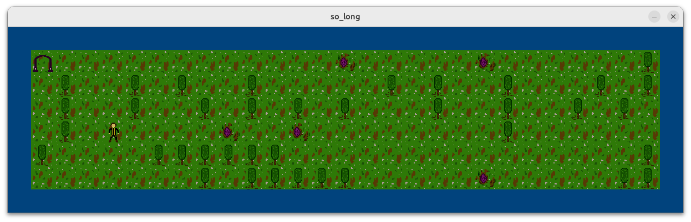

# 🗺️ So Long

A 42 project building a small 2D game using the **MiniLibX** graphical library in C.

---

## Introduction

So Long is a simple **2D top-down game** where the player must collect all collectibles on the map and reach the exit.  
The project introduces graphical programming in C using the **MiniLibX** library.

### Key Concepts

- **MiniLibX** — a simple graphical library to open windows, render images and handle events
- **Map parsing** — reading and validating a `.ber` map file
- **Event handling** — keyboard inputs to move the player
- **Sprite rendering** — loading and displaying textures/images
- **Flood fill** — algorithm to validate map accessibility

---

## Preview


---

## Usage

### Compilation

```bash
make        # Compile the project
make clean  # Remove object files
make fclean # Remove object files and binary
make re     # Full recompilation
```

### Running

```bash
./so_long maps/map.ber
```

### Map format `.ber`

| Character | Description |
|---|---|
| `0` | Empty space |
| `1` | Wall |
| `C` | Collectible |
| `E` | Exit |
| `P` | Player starting position |

> The map must be rectangular, surrounded by walls, contain at least one `C`, one `E` and one `P`.

---

## Controls

| Input | Action |
|---|---|
| `W` | Move up |
| `A` | Move left |
| `S` | Move down |
| `D` | Move right |
| `ESC` | Quit the game |

---

## Author

Made by [Arthur-PRZ](https://github.com/Arthur-PRZ)
